# Design Document

## Overview

O sistema é uma aplicação web Python com duas faces de execução. A face síncrona atende o navegador: autenticação, conexão de origens, importação e conferência de currículo, gestão de credenciais e leitura de relatórios. A face assíncrona executa os runs, que duram minutos ou horas porque cada requisição de enriquecimento é separada da seguinte por uma espera deliberada. Separar as duas não é preferência de estilo: um run não cabe no ciclo de vida de uma requisição HTTP, e prendê-lo ali transformaria toda contenção de taxa em tempo esgotado de navegador.

Três recursos escassos moldam o restante do desenho, cada um com um dono explícito. O primeiro é a **capacidade de coleta**, que vem de rotas públicas sem sessão e é serializada em todo o sistema porque a origem limita por requisição, não por conta; ela é distribuída entre usuários por um alocador de cota diária, porque acrescentar usuários não acrescenta capacidade. O segundo é a **credencial de modelo**, que pertence a cada usuário e não ao operador; isso inverte a economia — a capacidade de julgamento cresce com o número de usuários em vez de ser dividida — ao custo de guardar chave de terceiro cifrada e de tolerar que cada usuário tenha um provedor diferente. O terceiro é o **dado pessoal**, que pertence ao titular e precisa ser apagável em uma transação.

A extração de currículo passou a depender do provedor que o usuário escolheu, e a qualidade disso varia muito. O desenho responde tornando a conferência humana um portão de estado no banco, e não um passo de interface: um registro de extração nasce não confirmado e nenhum run enxerga extração não confirmada. Se o modelo do usuário errar, o erro para na tela de conferência em vez de contaminar buscas, score e recomendações em silêncio.

Todo texto que entra no sistema vindo de fora — descrição de vaga coletada e currículo enviado — é tratado como dado não confiável na fronteira do modelo de linguagem, e todo texto que sai para o navegador é escapado por construção.

Três peças deste desenho são bibliotecas maduras e não código nosso. A descoberta de vagas usa um coletor multi-portal já mantido, em vez de um cliente artesanal contra marcação que muda; o acesso a modelos de linguagem usa um roteador que já implementa cadeia ordenada de provedores com recuo e período de espera; e a persistência usa o banco embarcado da biblioteca padrão. A escolha em todos os três casos foi a mesma: onde existe biblioteca madura resolvendo exatamente o problema, escrevê-la de novo produziria uma versão pior e ainda assim nossa para manter.

### Change Type

new-feature

### Design Goals

1. Manter a capacidade de coleta serializada e distribuída, para que o número de usuários não multiplique o risco de bloqueio da instalação pela origem.
2. Deslocar o custo de modelo para a credencial do usuário, mantendo o sistema útil quando nenhuma credencial existe.
3. Fazer da conferência do currículo um portão de dados, para que extração ruim não se propague.
4. Tornar o isolamento entre usuários uma propriedade do acesso ao banco, e não uma disciplina de quem escreve consulta.
5. Manter a lista de provedores em configuração, para que o desaparecimento de uma oferta gratuita seja mudança de arquivo e não de código.
6. Delegar a bibliotecas mantidas a coleta multi-portal, o roteamento entre provedores de modelo e a persistência, reservando o código próprio ao que é específico deste produto.

### References

- **REQ-1**: Autenticação do usuário por conta Google
- **REQ-2**: Conexão da conta LinkedIn do usuário
- **REQ-3**: Importação de currículo
- **REQ-4**: Extração estruturada do currículo
- **REQ-5**: Consolidação do perfil-alvo
- **REQ-6**: Diagnóstico de higiene do perfil
- **REQ-7**: Planejamento determinístico de buscas
- **REQ-8**: Coleta e deduplicação de vagas
- **REQ-9**: Pré-filtro antes do enriquecimento
- **REQ-10**: Enriquecimento de descrição
- **REQ-11**: Contenção de bloqueio na coleta
- **REQ-12**: Distribuição da cota de coleta entre usuários
- **REQ-13**: Pontuação determinística de aderência
- **REQ-14**: Detecção de lacunas e diferenciais
- **REQ-15**: Síntese estratégica por modelo de linguagem
- **REQ-16**: Contenção de injeção de prompt
- **REQ-17**: Modo determinístico sem modelo de linguagem
- **REQ-18**: Apresentação do relatório ao usuário
- **REQ-19**: Isolamento entre usuários
- **REQ-20**: Direitos do titular sobre os dados pessoais
- **REQ-21**: Persistência e ciclo de vida das vagas
- **REQ-22**: Execução recorrente
- **REQ-23**: Proteção de credenciais e segredos
- **REQ-24**: Configuração do serviço
- **REQ-25**: Registro de provedores de modelo de linguagem
- **REQ-26**: Credencial de modelo fornecida pelo usuário

## System Architecture

### DES-1: Topologia de execução

A aplicação se divide em três processos que compartilham o banco e nada mais. O processo web atende o navegador e nunca executa um estágio de run. O processo de runs consome uma fila e executa o pipeline de um usuário por vez. O processo de enriquecimento é único em toda a instalação, o que torna a serialização exigida pela contenção uma consequência da topologia e não uma trava que alguém precisa lembrar de adquirir.

A fila vive no próprio banco. Um consumidor reserva o próximo run dentro de uma transação exclusiva curta que marca a linha como reservada antes de liberar o banco. Não há necessidade de reserva com salto de linhas travadas: existe um único consumidor de runs e um único consumidor de enriquecimento, então nunca há dois leitores disputando a mesma linha. Isso dispensa um serviço de fila separado e mantém o estado da fila dentro da mesma transação que grava o resultado.

Um run não é uma execução contínua: ele é dividido em dois trechos por um ponto de suspensão. O primeiro trecho vai do planejamento até a pontuação provisória e termina gravando os pedidos de enriquecimento numa fila própria; o run passa então a aguardando enriquecimento e o processo de runs solta o worker. O processo de enriquecimento consome essa fila no seu próprio ritmo e, ao esgotar os pedidos de um run, reenfileira o run para o segundo trecho, que faz a pontuação final, a síntese e o relatório. Nenhum processo espera outro de forma síncrona, e a espera deliberada do governador — que é o intervalo mais longo de todo o run — não ocupa worker nenhum. Um processo que morra no meio deixa o run num estado nomeado e retomável, em vez de deixar um worker preso.

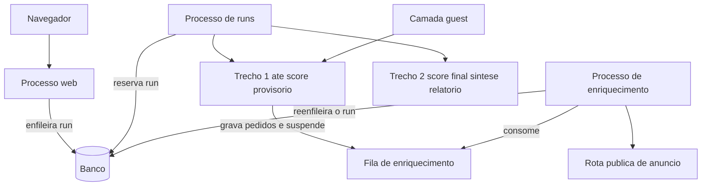
```mermaid
flowchart TD
    A[Navegador] --> B[Processo web]
    B -->|enfileira run| C[(Banco)]
    D[Processo de runs] -->|reserva run| C
    D --> E[Trecho 1 ate score provisorio]
    E -->|grava pedidos e suspende| F[Fila de enriquecimento]
    G[Processo de enriquecimento] -->|consome| F
    G --> H[Rota publica de anuncio]
    G -->|reenfileira o run| C
    D --> I[Trecho 2 score final sintese relatorio]
    J[Camada guest] --> E
```

_Implements: REQ-11.1, REQ-17.1, REQ-21.5, REQ-22.2, REQ-22.4_

### DES-2: Identidade e sessão

A autenticação usa o fluxo de autorização do Google com verificação de código. O sistema deriva a identidade interna do identificador de assunto devolvido pelo provedor, nunca do endereço de e-mail, porque e-mail é mutável e reatribuível e usá-lo como chave transformaria uma troca de endereço em perda ou fusão indevida de conta.

A sessão é um registro no banco referenciado por um testemunho opaco no navegador, e não um token autocontido. Isso permite encerrar uma sessão de fato e permite que a expiração seja avaliada contra o relógio do servidor. O testemunho trafega em cookie inacessível a script, restrito a transporte cifrado e com política de envio entre sítios que impede que outro sítio o acione; o banco guarda apenas o resumo criptográfico dele, para que a leitura da tabela não renda sessões utilizáveis. O retorno do fluxo de autorização é aceito somente com o parâmetro de estado e o verificador de código gerados no início do fluxo. Encerrar a sessão apaga apenas a sessão: os testemunhos das origens conectadas sobrevivem, porque sair do sistema não é desconectar o LinkedIn nem o Drive.

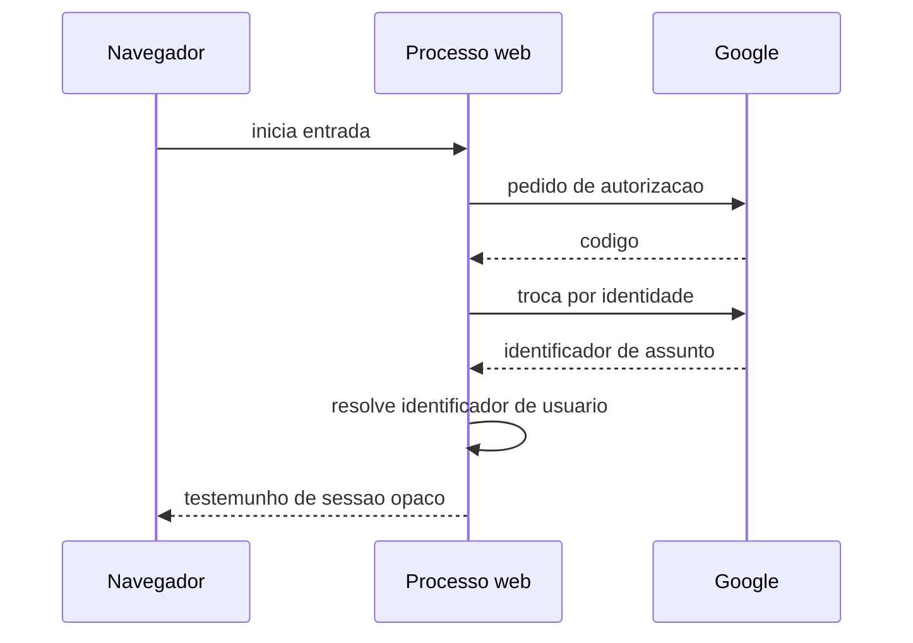
```mermaid
sequenceDiagram
    participant N as Navegador
    participant W as Processo web
    participant G as Google
    N->>W: inicia entrada
    W->>G: pedido de autorizacao
    G-->>W: codigo
    W->>G: troca por identidade
    G-->>W: identificador de assunto
    W->>W: resolve identificador de usuario
    W-->>N: testemunho de sessao opaco
```

_Implements: REQ-1.1, REQ-1.2, REQ-1.3, REQ-1.4, REQ-1.5, REQ-1.6_

### DES-3: Conexão da conta LinkedIn

A conexão usa o fluxo de autorização oficial do LinkedIn e guarda apenas o que os escopos concedidos devolvem. O conector registra a lista de escopos efetivamente concedidos junto aos dados, porque o que a plataforma entrega varia por aplicação e por consentimento, e um campo ausente precisa ser distinguível entre "o usuário não tem" e "o escopo não permite ler".

Não existe caminho no sistema que aceite senha, cookie ou sessão de LinkedIn de um usuário. Isso é imposto na fronteira do conector: ele expõe apenas a conclusão do fluxo de autorização, e qualquer outro material de credencial submetido é recusado antes de qualquer armazenamento.

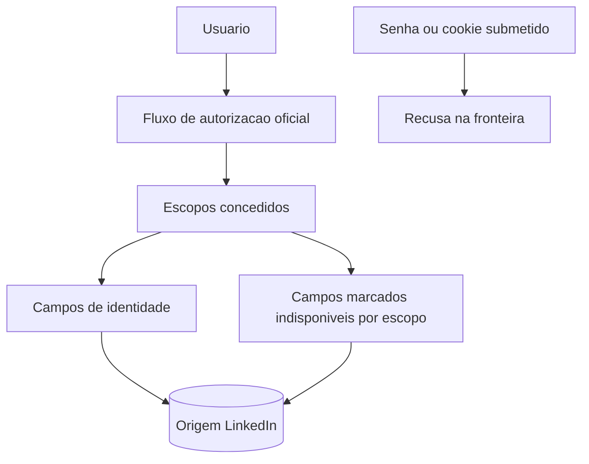
```mermaid
flowchart TD
    A[Usuario] --> B[Fluxo de autorizacao oficial]
    B --> C[Escopos concedidos]
    C --> D[Campos de identidade]
    C --> E[Campos marcados indisponiveis por escopo]
    D --> F[(Origem LinkedIn)]
    E --> F
    G[Senha ou cookie submetido] --> H[Recusa na fronteira]
```

_Implements: REQ-2.1, REQ-2.2, REQ-2.3, REQ-2.4, REQ-2.5, REQ-2.6_

### DES-4: Registro de provedores e cofre de credenciais

O registro de provedores é carregado de configuração e valida cada entrada antes de oferecê-la. Um provedor declara endereço, formato de credencial, modelos, limite anunciado e se executa em máquina do operador ou por rede externa. O registro aceita apenas formato de credencial que seja chave estática ou ausência de credencial, o que exclui por construção qualquer provedor que exigiria registrar uma aplicação. Provedor que falha na verificação de disponibilidade some da lista oferecida em vez de aparecer e falhar depois.

O cofre guarda as credenciais dos usuários com cifragem envelopada: cada credencial é cifrada com uma chave de dado própria, e essa chave é cifrada por uma chave mestra vinda da configuração. O valor em claro existe apenas durante a requisição que o usa. Nenhuma leitura do cofre devolve o valor para a interface; a tela mostra o provedor, o instante de cadastro e um sufixo, nunca a chave. A ordem de tentativa entre provedores pertence ao usuário e é semeada, no primeiro cadastro, a partir da ordem padrão do operador.

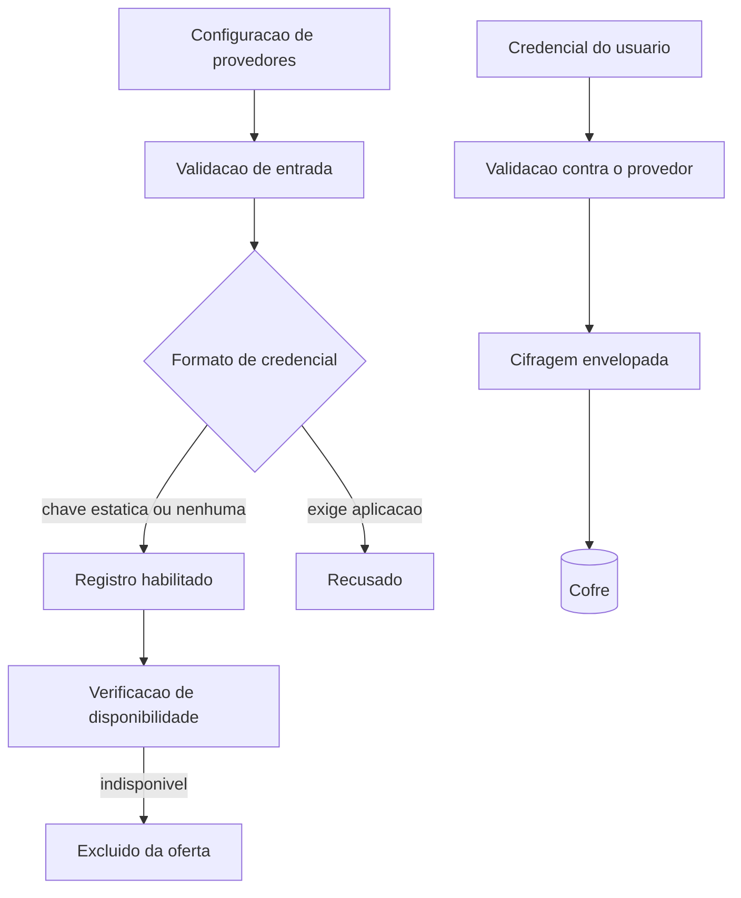
```mermaid
flowchart TD
    A[Configuracao de provedores] --> B[Validacao de entrada]
    B --> C{Formato de credencial}
    C -->|chave estatica ou nenhuma| D[Registro habilitado]
    C -->|exige aplicacao| E[Recusado]
    D --> F[Verificacao de disponibilidade]
    F -->|indisponivel| G[Excluido da oferta]
    H[Credencial do usuario] --> I[Validacao contra o provedor]
    I --> J[Cifragem envelopada]
    J --> K[(Cofre)]
```

_Implements: REQ-23.4, REQ-25.1, REQ-25.2, REQ-25.3, REQ-25.4, REQ-25.5, REQ-25.6, REQ-25.7, REQ-26.1, REQ-26.2, REQ-26.3, REQ-26.4, REQ-26.5, REQ-26.6, REQ-26.11, REQ-26.12_

### DES-5: Cliente de modelo com cadeia de fallback

Todo uso de modelo de linguagem passa por um cliente único que recebe uma tarefa lógica e a resolve contra a cadeia de provedores do usuário. Uma recusa por limite de uso avança para o próximo provedor da ordem daquele usuário; o esgotamento da cadeia devolve uma falha que o chamador converte em modo determinístico. Uma tarefa lógica que atravessa vários provedores continua sendo uma única requisição de síntese, e é assim que o limite de uma síntese por run convive com a cadeia de tentativas.

O roteamento em si não é código nosso. Um roteador de biblioteca já resolve a lista ordenada de destinos, o recuo exponencial, o período de espera por provedor que acabou de recusar e a normalização do formato de requisição entre provedores diferentes. O nosso cliente é a camada fina em volta dele: monta a lista ordenada a partir do cofre do usuário, aplica a contenção de injeção, decide o que é falha recuperável e converte o esgotamento em modo determinístico. Reimplementar o roteamento produziria uma versão pior de algo já resolvido, e ainda assim nossa para manter quando um provedor mudasse o formato de erro.

O cliente é também a fronteira de contenção. Ele monta a instrução de sistema a partir de um gabarito do repositório, envolve todo texto de origem externa em um delimitador de dado não confiável, trunca esse texto no limite configurado e recusa o uso da credencial de um usuário em trabalho de outro. Nenhum estágio fala com um provedor diretamente, o que torna essas garantias estruturais.

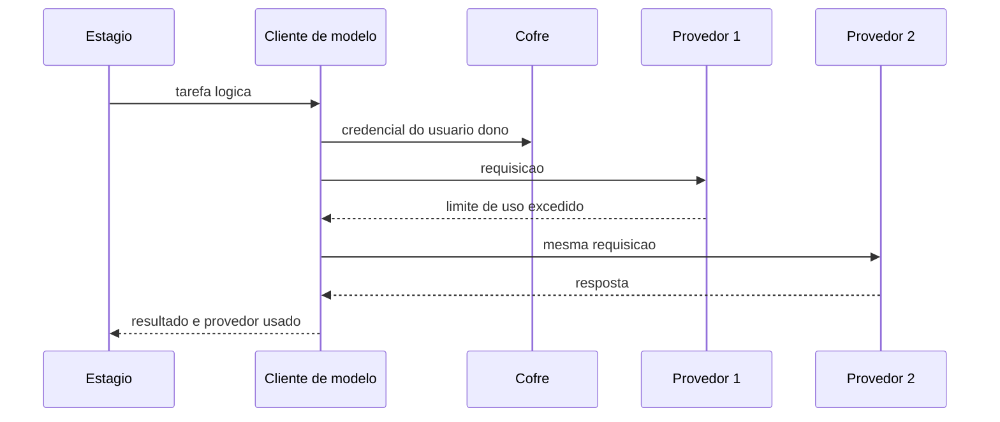
```mermaid
sequenceDiagram
    participant E as Estagio
    participant C as Cliente de modelo
    participant V as Cofre
    participant P1 as Provedor 1
    participant P2 as Provedor 2
    E->>C: tarefa logica
    C->>V: credencial do usuario dono
    C->>P1: requisicao
    P1-->>C: limite de uso excedido
    C->>P2: mesma requisicao
    P2-->>C: resposta
    C-->>E: resultado e provedor usado
```

_Implements: REQ-16.1, REQ-16.2, REQ-16.3, REQ-26.7, REQ-26.8, REQ-26.9, REQ-26.10_

### DES-6: Importação de currículo

O importador aceita três origens e as reduz a um mesmo artefato: texto puro mais a procedência. Para o Google Drive ele pede o escopo de leitura mínimo necessário para exportar o documento selecionado e exporta como texto. Para arquivos enviados, extrai o texto do formato correspondente. Os limites de tamanho e de frequência são verificados antes de qualquer extração, porque a etapa cara vem depois.

Um documento cujo texto extraído fica abaixo do comprimento mínimo é recusado com a hipótese explícita de página digitalizada sem camada de texto. Essa recusa é uma decisão de produto: um currículo em imagem produziria uma extração vazia que passaria adiante como perfil pobre, e um perfil pobre gera buscas ruins que o usuário atribuiria ao sistema, não ao documento.

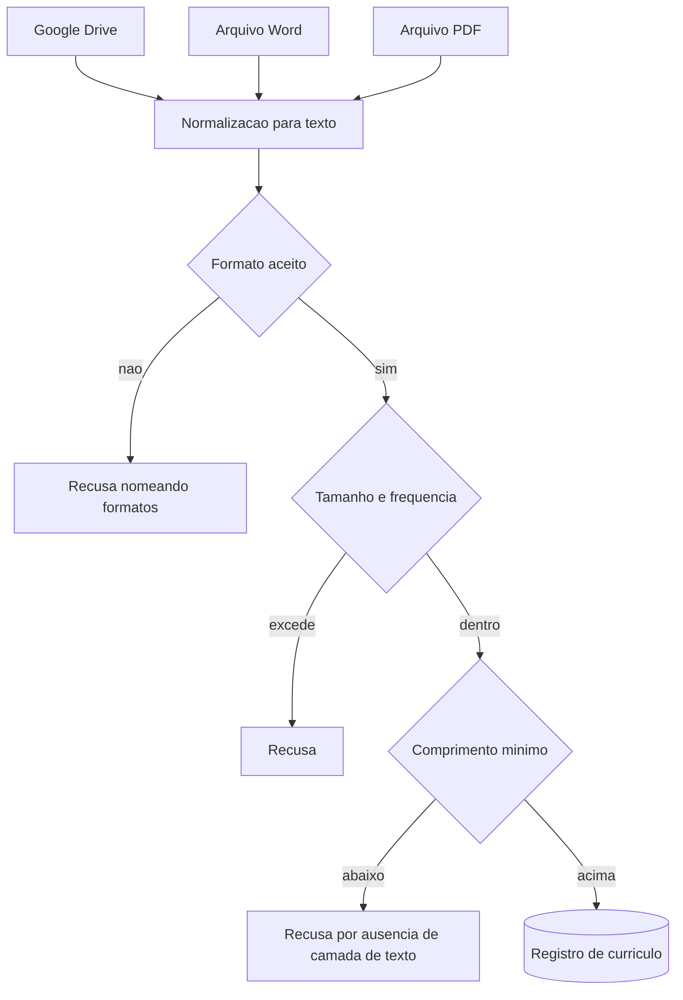
```mermaid
flowchart TD
    A[Google Drive] --> D[Normalizacao para texto]
    B[Arquivo Word] --> D
    C[Arquivo PDF] --> D
    D --> E{Formato aceito}
    E -->|nao| F[Recusa nomeando formatos]
    E -->|sim| G{Tamanho e frequencia}
    G -->|excede| H[Recusa]
    G -->|dentro| I{Comprimento minimo}
    I -->|abaixo| J[Recusa por ausencia de camada de texto]
    I -->|acima| K[(Registro de curriculo)]
```

_Implements: REQ-3.1, REQ-3.2, REQ-3.3, REQ-3.4, REQ-3.5, REQ-3.6, REQ-3.7, REQ-3.8, REQ-3.9_

### DES-7: Extração estruturada e portão de conferência

A extração converte o texto do currículo em campos usando o provedor do próprio usuário, e registra qual provedor e qual modelo produziram cada resultado, porque a qualidade varia e a proveniência é o que permite explicar um perfil ruim depois. Cada campo extraído guarda o trecho de texto que o originou; campo ausente vira nulo mais uma entrada na lista de lacunas, para que a ausência seja um dado.

A conferência é um estado no banco, não uma tela. O registro nasce não confirmado, e o consolidador de perfil ignora registro não confirmado. Uma correção do usuário é gravada como origem de edição manual ao lado do valor extraído, sem sobrescrevê-lo, o que preserva a comparação entre o que o modelo leu e o que o humano corrigiu. Usuário sem credencial não vê a extração falhar: o caminho automático simplesmente não é oferecido, e o preenchimento manual aparece no lugar sem que nenhuma requisição saia.

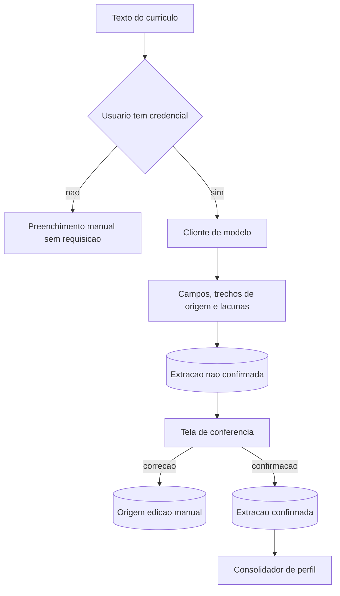
```mermaid
flowchart TD
    A[Texto do curriculo] --> B{Usuario tem credencial}
    B -->|nao| C[Preenchimento manual sem requisicao]
    B -->|sim| D[Cliente de modelo]
    D --> E[Campos, trechos de origem e lacunas]
    E --> F[(Extracao nao confirmada)]
    F --> G[Tela de conferencia]
    G -->|correcao| H[(Origem edicao manual)]
    G -->|confirmacao| I[(Extracao confirmada)]
    I --> J[Consolidador de perfil]
```

_Implements: REQ-4.1, REQ-4.2, REQ-4.3, REQ-4.4, REQ-4.5, REQ-4.6, REQ-4.7, REQ-4.8, REQ-4.9, REQ-4.10, REQ-4.11, REQ-4.12, REQ-16.5_

### DES-8: Consolidação de perfil e higiene

O consolidador produz uma versão imutável do perfil-alvo cada vez que uma origem muda. Cada campo do resultado carrega a origem que o forneceu, resolvida pela precedência configurada: edição manual sobre currículo, currículo sobre conexão LinkedIn. Essa ordem reflete a realidade da plataforma, em que os escopos abertos devolvem identidade e não devolvem histórico; inverter a precedência faria a identidade sobrescrever o conteúdo.

A inferência de nível e o diagnóstico de higiene são funções puras sobre a versão consolidada. Higiene compara períodos entre experiências e emite uma lista sempre presente, vazia quando nada é detectado, com o campo de origem e o trecho que motivou cada item. Ausência de histórico em todas as origens não é tratada como perfil vazio: é uma recusa explícita de iniciar run, com a instrução de importar currículo.

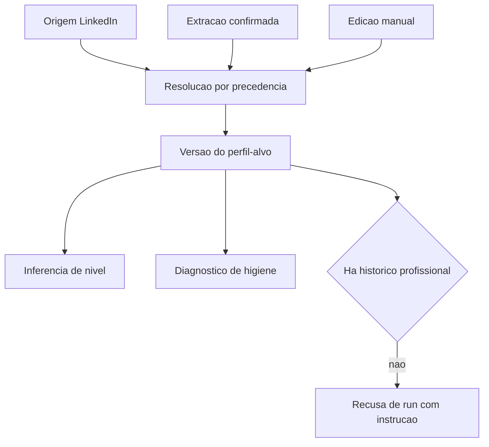
```mermaid
flowchart TD
    A[Origem LinkedIn] --> D[Resolucao por precedencia]
    B[Extracao confirmada] --> D
    C[Edicao manual] --> D
    D --> E[Versao do perfil-alvo]
    E --> F[Inferencia de nivel]
    E --> G[Diagnostico de higiene]
    E --> H{Ha historico profissional}
    H -->|nao| I[Recusa de run com instrucao]
```

_Implements: REQ-5.1, REQ-5.2, REQ-5.3, REQ-5.4, REQ-5.5, REQ-5.6, REQ-5.7, REQ-5.8, REQ-6.1, REQ-6.2, REQ-6.3_

### DES-9: Planejador de buscas

O planejador é uma função pura de perfil e configuração para lista de buscas, sem qualquer chamada de modelo. Ele extrai eixos de função do histórico consolidado, combina cada eixo com os rótulos de nível correspondentes ao nível inferido, acrescenta âncoras literais da configuração e emite em português e em inglês. Buscas de termo único são descartadas na saída, porque o casamento difuso da origem as transforma em ruído.

A pureza é requisito de produto: dois runs do mesmo perfil com a mesma configuração precisam gerar a mesma lista, para que a diferença de resultado entre dois dias seja atribuível ao mercado. A saída é ordenada por chave textual antes de retornar.

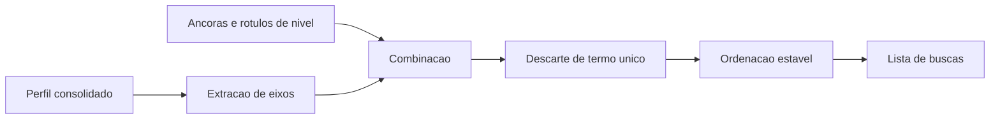
```mermaid
flowchart LR
    A[Perfil consolidado] --> B[Extracao de eixos]
    C[Ancoras e rotulos de nivel] --> D[Combinacao]
    B --> D
    D --> E[Descarte de termo unico]
    E --> F[Ordenacao estavel]
    F --> G[Lista de buscas]
```

_Implements: REQ-7.1, REQ-7.2, REQ-7.3, REQ-7.4, REQ-7.5, REQ-7.6, REQ-7.7_

### DES-10: Coletor e deduplicação

O coletor executa as buscas contra a camada guest através de um coletor multi-portal mantido por terceiros, que não requer sessão e absorve o volume de descoberta. Ele devolve, por vaga, identificador, título, empresa, localidade, modelo de trabalho, data de publicação, URL canônica e faixa salarial na chamada de descoberta, e descrição com endereços de e-mail encontrados no texto numa segunda chamada, feita depois do pré-filtro pelo enriquecedor. A adoção evita manter um cliente artesanal contra marcação que muda com frequência, que era o item de maior probabilidade na nossa própria matriz de risco.

O coletor externo é isolado atrás do mesmo protocolo de fonte dos demais adaptadores, e a sua saída tabular é convertida para o card normalizado do sistema no próprio adaptador. Nada além do adaptador conhece o formato da biblioteca, o que mantém a troca por outra fonte como mudança local. A deduplicação ocorre em memória dentro do run e contra o banco para separar vaga nova de vaga conhecida. Busca vazia e busca com falha são registradas de forma distinta, porque a primeira é sinal de mercado e a segunda é sinal de defeito.

A biblioteca cobre vários portais além do LinkedIn, e alguns deles não impõem limite de requisição comparável. Esta versão do desenho habilita apenas o portal previsto nos requisitos aprovados; ativar os demais é mudança de configuração, mas depende de emenda ao glossário da Fase 1, que hoje define a camada guest como endpoints públicos do LinkedIn.

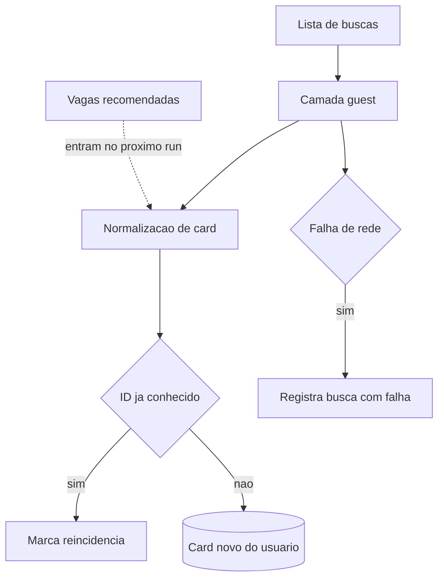
```mermaid
flowchart TD
    A[Lista de buscas] --> B[Camada guest]
    B --> C[Normalizacao de card]
    D[Vagas recomendadas] -.->|entram no proximo run| C
    C --> E{ID ja conhecido}
    E -->|sim| F[Marca reincidencia]
    E -->|nao| G[(Card novo do usuario)]
    B --> H{Falha de rede}
    H -->|sim| I[Registra busca com falha]
```

_Implements: REQ-8.1, REQ-8.2, REQ-8.3, REQ-8.5, REQ-8.6, REQ-8.7_

### DES-11: Pré-filtro

O pré-filtro roda inteiro antes que qualquer enriquecimento comece, porque sua razão de existir é reduzir consumo de um recurso escasso e compartilhado. Ele aplica padrões de rejeição de título vindos da configuração e uma avaliação geográfica que compara modelo de trabalho e cidade da vaga com o raio do perfil-alvo.

A distinção entre descartar e marcar é deliberada. Título fora de escopo elimina o card com o motivo registrado. Vaga presencial fora do raio permanece com um blocker que nomeia cidade e distância, porque a decisão de mudar pertence ao candidato e não ao filtro. Vaga remota nunca é avaliada geograficamente.

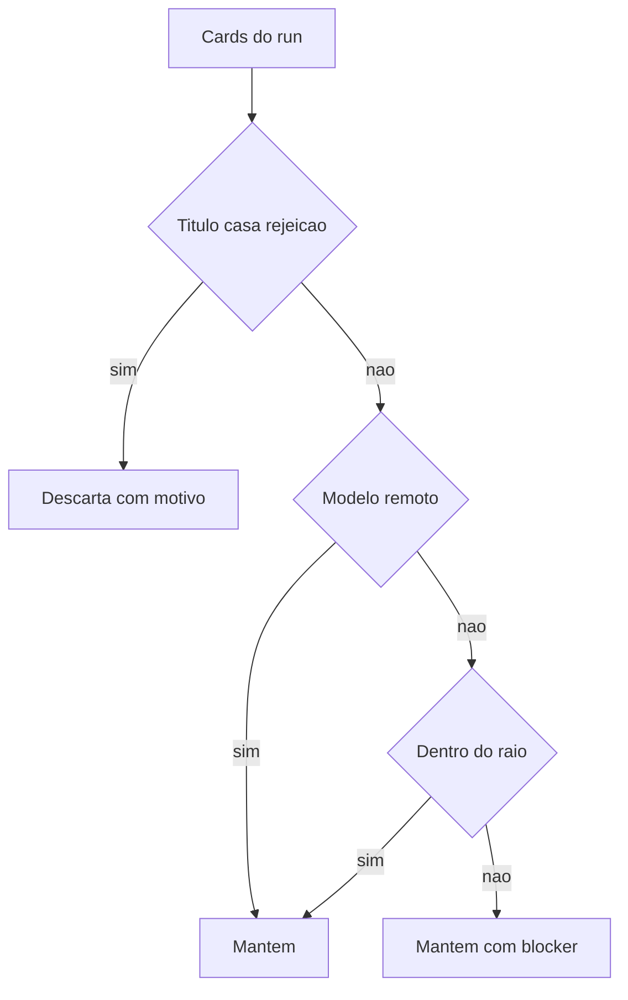
```mermaid
flowchart TD
    A[Cards do run] --> B{Titulo casa rejeicao}
    B -->|sim| C[Descarta com motivo]
    B -->|nao| D{Modelo remoto}
    D -->|sim| E[Mantem]
    D -->|nao| F{Dentro do raio}
    F -->|sim| E
    F -->|nao| G[Mantem com blocker]
```

_Implements: REQ-9.1, REQ-9.2, REQ-9.3, REQ-9.4, REQ-9.5, REQ-9.6_

### DES-12: Enriquecimento e governador de taxa

A divisão de trabalho entre as camadas mudou com a adoção do coletor externo, mas a ordem dos estágios não. A descrição vem da rota pública e continua sendo obtida **depois** do pré-filtro: a descoberta pede ao coletor apenas os cards, sem descrição, e o enriquecimento faz uma segunda chamada, restrita às vagas sobreviventes. A biblioteca oferece trazer a descrição já na busca, e usá-la assim seria um erro caro — pela definição dos requisitos isso é enriquecer, aconteceria antes do pré-filtro e pagaria descrição das quarenta vagas coletadas em vez das doze que sobrevivem.

O desenho original reservava a uma camada operacional autenticada o que se supunha exclusivo dela: os sinais do card, os dados de concorrência e as vagas recomendadas. Medido contra a origem real, o pressuposto era falso — a própria rota pública devolve os sinais e a contagem de candidatos na mesma resposta da descrição, sem segunda chamada. A camada operacional saiu do desenho junto com as vagas recomendadas, que eram o único item que de fato dependia de sessão. Uma vaga sem sinais é apenas uma vaga pontuada sem os ajustes de bônus, e não uma vaga sem descrição.

O enriquecedor continua sendo o único componente que grava o registro compartilhado de descrições e os endereços de contato extraídos dela, independentemente de a descrição ter vindo da rota pública ou da sessão. Concentrar a gravação nele é o que mantém o acerto de cache e o débito de cota numa decisão só; deixar o coletor gravar descrição furaria os dois.

O enriquecimento é executado por um processo único. Ele consulta primeiro o registro compartilhado de descrições, indexado por identificador de vaga e comum a todos os usuários, e só solicita à origem quando não há acerto. Uma descrição coletada nunca expira, porque o texto de um anúncio não muda e toda nova leitura é risco sem retorno; a partilha entre usuários é o que torna o segundo usuário de uma vaga popular gratuito em termos de cota.

O governador é o único ponto do sistema que emite requisição à origem. Ele impõe execução serial, espera um intervalo aleatório entre chamadas, aplica recuo crescente a cada tempo esgotado e conta falhas consecutivas. Ao terceiro fracasso seguido grava um bloqueio de coleta e passa a recusar toda chamada, o que transforma o bloqueio em um estado observável em vez de uma sequência de tempos esgotados no log. Credencial de usuário nunca chega a esse processo: ele conhece apenas identificador e endereço de vaga.

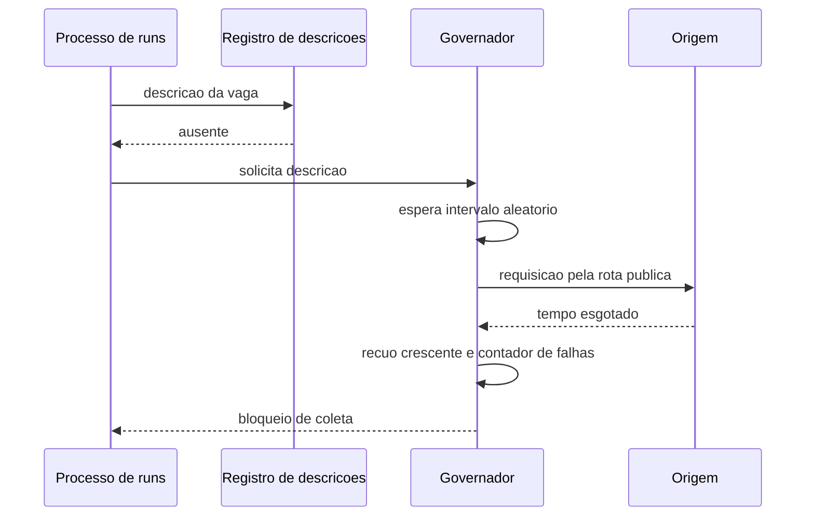
```mermaid
sequenceDiagram
    participant R as Processo de runs
    participant C as Registro de descricoes
    participant G as Governador
    participant L as Origem
    R->>C: descricao da vaga
    C-->>R: ausente
    R->>G: solicita descricao
    G->>G: espera intervalo aleatorio
    G->>L: requisicao pela rota publica
    L-->>G: tempo esgotado
    G->>G: recuo crescente e contador de falhas
    G-->>R: bloqueio de coleta
```

_Implements: REQ-10.1, REQ-10.2, REQ-10.3, REQ-10.4, REQ-10.5, REQ-10.6, REQ-10.7, REQ-11.1, REQ-11.2, REQ-11.3, REQ-11.4, REQ-11.5, REQ-11.6_

### DES-13: Alocador de cota

A cota traduz um orçamento diário global em um teto por usuário, recalculado a cada débito como o orçamento dividido pelo número corrente de usuários ativos no dia. O teto é avaliado sempre contra o consumo já registrado e nunca o reduz: um usuário que entra no meio do dia encolhe o teto de todos daí em diante, mas quem já gastou não fica com consumo acima do próprio teto nem tem requisição revogada — apenas para de receber cota nova mais cedo. Tratar o teto como limite móvel avaliado no momento do débito, e não como saldo distribuído no início do dia, é o que mantém o estado sempre representável.

Cada enriquecimento efetivamente pago debita a cota do usuário que o motivou; um acerto no registro compartilhado de descrições não debita nada, porque não houve requisição. Esgotada a cota, novos enriquecimentos daquele usuário são recusados e a recusa fica registrada no run, o que permite ao relatório dizer quantas vagas ficaram sem descrição por limite e não por falha.

As cotas do dia são criadas do zero a cada virada, sem transporte de saldo. Acumular saldo transformaria um usuário inativo por uma semana em um pico de requisições capaz de fazer a origem bloquear a instalação inteira, que é exatamente o risco que a cota existe para conter.

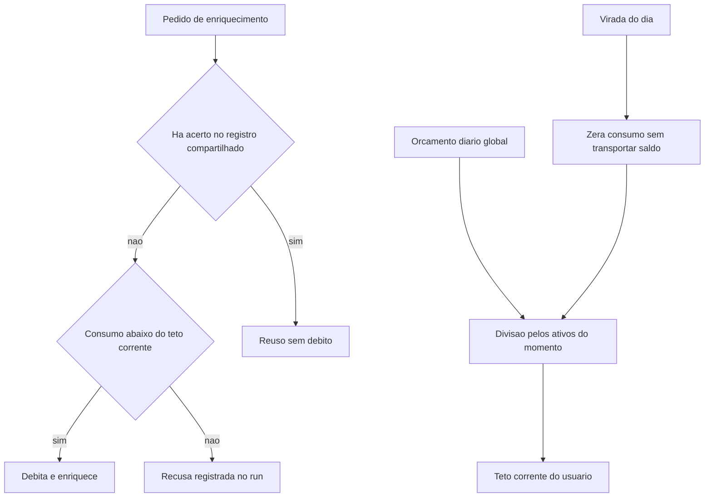
```mermaid
flowchart TD
    A[Orcamento diario global] --> B[Divisao pelos ativos do momento]
    B --> C[Teto corrente do usuario]
    D[Pedido de enriquecimento] --> E{Ha acerto no registro compartilhado}
    E -->|sim| F[Reuso sem debito]
    E -->|nao| G{Consumo abaixo do teto corrente}
    G -->|sim| H[Debita e enriquece]
    G -->|nao| I[Recusa registrada no run]
    J[Virada do dia] --> K[Zera consumo sem transportar saldo]
    K --> B
```

_Implements: REQ-12.1, REQ-12.2, REQ-12.3, REQ-12.4, REQ-12.5_

### DES-14: Pontuação em duas passadas, ontologia e lacunas

O scorer roda duas vezes por run com a mesma função e entradas diferentes. A passada provisória usa apenas o que a camada guest entregou e serve para ordenar a fila de enriquecimento; a passada final acrescenta sinais do card e dados de concorrência obtidos sob sessão e é a que vale para o relatório. As duas passadas existem porque a escolha do alvo da cota depende de um score, e o score final depende do que a cota pagaria — pontuar uma vez só seria circular.

A comparação de competências passa por uma ontologia de sinônimos que reduz variantes a um termo canônico antes de qualquer interseção. Lacunas e diferenciais reutilizam exatamente esses conjuntos, o que garante que a lista mostrada ao usuário seja consistente com o componente que compôs o score. Bônus e penalidades são aplicados sobre a soma ponderada e só depois o resultado é limitado ao intervalo válido; limitar antes produziria valores diferentes para a mesma entrada.

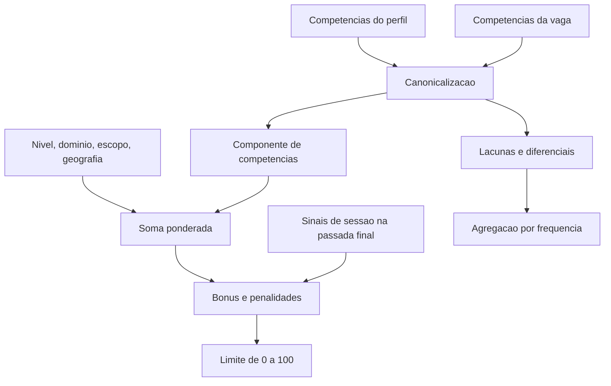
```mermaid
flowchart TD
    A[Competencias do perfil] --> B[Canonicalizacao]
    C[Competencias da vaga] --> B
    B --> D[Componente de competencias]
    E[Nivel, dominio, escopo, geografia] --> F[Soma ponderada]
    D --> F
    F --> G[Bonus e penalidades]
    H[Sinais de sessao na passada final] --> G
    G --> I[Limite de 0 a 100]
    B --> J[Lacunas e diferenciais]
    J --> K[Agregacao por frequencia]
```

_Implements: REQ-13.1, REQ-13.2, REQ-13.3, REQ-13.4, REQ-13.5, REQ-13.6, REQ-13.7, REQ-13.8, REQ-13.9, REQ-13.10, REQ-13.11, REQ-14.1, REQ-14.2, REQ-14.3, REQ-14.4, REQ-14.5, REQ-14.6_

### DES-15: Sintetizador, aterramento e injeção

O sintetizador é um estágio terminal que lê apenas dados persistidos e emite uma requisição de síntese por run através do cliente de modelo, com as vagas de maior score até o limite configurado. Ele exige da resposta a classificação de cada afirmação não trivial e a distinção entre vaga lida e vaga avaliada apenas por card, porque uma recomendação sem essa distinção induziria o usuário a confiar igualmente em avaliações de qualidade desigual.

O verificador de aterramento confronta os identificadores citados na resposta com o conjunto enviado; qualquer identificador estranho invalida a resposta inteira e grava uma violação. Falha de rede, resposta inválida, cadeia de provedores esgotada e violação de aterramento convergem para o mesmo efeito operacional: falha de síntese registrada no run e relatório gerado sem essa seção.

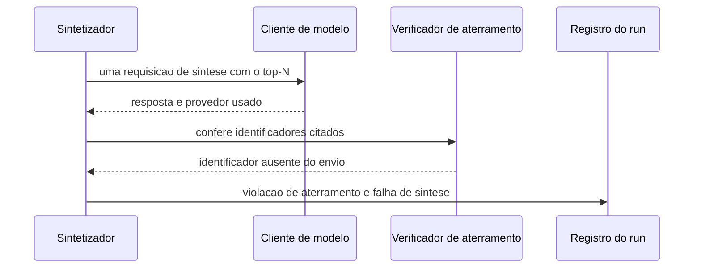
```mermaid
sequenceDiagram
    participant S as Sintetizador
    participant C as Cliente de modelo
    participant V as Verificador de aterramento
    participant R as Registro do run
    S->>C: uma requisicao de sintese com o top-N
    C-->>S: resposta e provedor usado
    S->>V: confere identificadores citados
    V-->>S: identificador ausente do envio
    S->>R: violacao de aterramento e falha de sintese
```

_Implements: REQ-15.1, REQ-15.2, REQ-15.3, REQ-15.4, REQ-15.5, REQ-15.6, REQ-15.7, REQ-15.8, REQ-15.9, REQ-15.10, REQ-15.11, REQ-15.12, REQ-16.4_

### DES-16: Renderização do relatório

O relatório é uma página servida ao usuário dono do run, montada apenas a partir de dados persistidos e sem qualquer requisição à origem. Isso a torna reexecutável sobre qualquer run passado e independente do estado da origem. As vagas aparecem por score decrescente, com destaque para as novas que atingem o limiar, e a página carrega também o que outros estágios produziram e nada mais entregaria: problemas de higiene do perfil e o ranking de competências por frequência.

O escape do texto de origem é obtido por construção. O motor de gabarito opera com escape automático ligado, de modo que exibir texto não escapado exigiria um gesto explícito ausente do gabarito; descrição de vaga, título, empresa, endereço de e-mail e texto de currículo recebem o mesmo tratamento. Estados degradados são visíveis em vez de silenciosos: modo determinístico, falha de síntese, cota esgotada e ausência total de sobreviventes ao pré-filtro têm cada um a sua marcação.

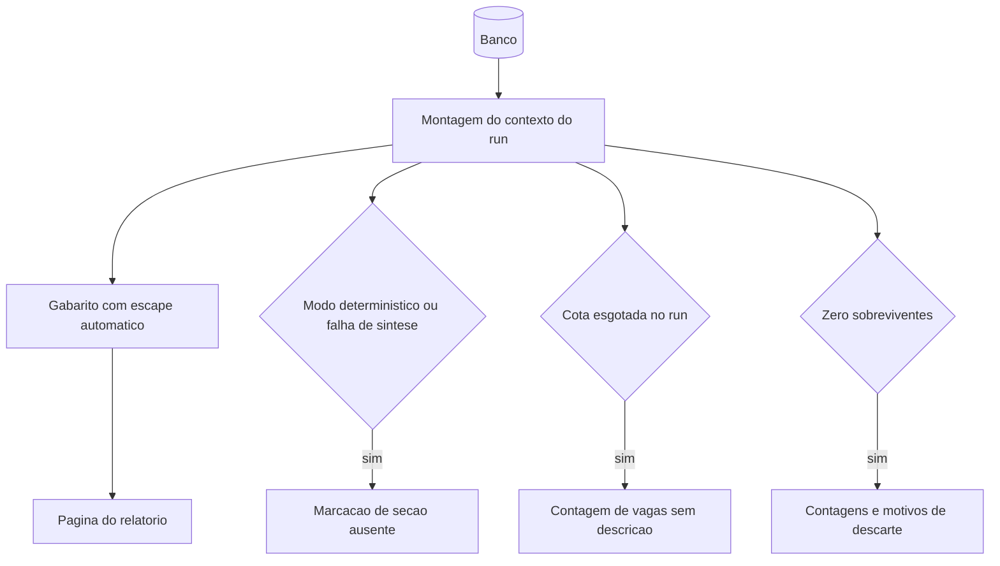
```mermaid
flowchart TD
    A[(Banco)] --> B[Montagem do contexto do run]
    B --> C[Gabarito com escape automatico]
    C --> D[Pagina do relatorio]
    B --> E{Modo deterministico ou falha de sintese}
    E -->|sim| F[Marcacao de secao ausente]
    B --> G{Cota esgotada no run}
    G -->|sim| H[Contagem de vagas sem descricao]
    B --> I{Zero sobreviventes}
    I -->|sim| J[Contagens e motivos de descarte]
```

_Implements: REQ-17.1, REQ-17.2, REQ-17.3, REQ-18.1, REQ-18.2, REQ-18.3, REQ-18.4, REQ-18.5, REQ-18.6, REQ-18.7, REQ-18.8, REQ-18.9, REQ-18.10, REQ-18.11, REQ-18.12, REQ-18.13, REQ-18.14_

### DES-17: Persistência, isolamento e direitos do titular

O banco é SQLite em modo de escrita antecipada, acessado pela biblioteca padrão. A escolha decorre do teto de vazão do próprio sistema: a contenção exige um enriquecimento por vez em toda a instalação, e o processo que o executa detém uma sessão de navegador. O sistema já está preso a um único host por esse motivo, de modo que a principal vantagem de um servidor de banco — vários processos em várias máquinas escrevendo ao mesmo tempo — é uma capacidade que este desenho já pagou para não ter. Com espera deliberada entre enriquecimentos e orçamento diário limitado, o pico de escrita fica na ordem de algumas transações por minuto, longe do regime em que a diferença entre os dois bancos aparece. Em troca, o operador não instala serviço, não gerencia credencial de banco e faz cópia de segurança copiando um arquivo. O custo aceito é conhecido: hospedagem de disco efêmero e mais de uma instância web deixam de ser opção, e as duas já estavam fora pelo motivo anterior. Toda tabela de dado de usuário carrega o identificador de usuário e o acesso passa por um repositório que injeta esse filtro em cada consulta; o isolamento é propriedade da camada de acesso e não disciplina de quem escreve consulta. Uma referência a recurso de outro usuário resulta em recusa registrada.

O registro de descrições é a única tabela deliberadamente compartilhada, e ela não guarda quem coletou o quê — o vínculo usuário-vaga vive na tabela de cards. Isso é o que permite a exclusão de conta apagar tudo do titular e ainda assim preservar um bem comum que não é dado pessoal dele. A máquina de estados da vaga é avançada por um componente separado do coletor, e a expiração conta apenas ausências em runs cuja janela de publicação de fato cobria a vaga: um run incremental de vinte e quatro horas jamais reencontra uma vaga de vinte dias, e contar essa ausência expiraria todo o acervo. O esquema carrega número de versão e migrações aplicadas em ordem na abertura.

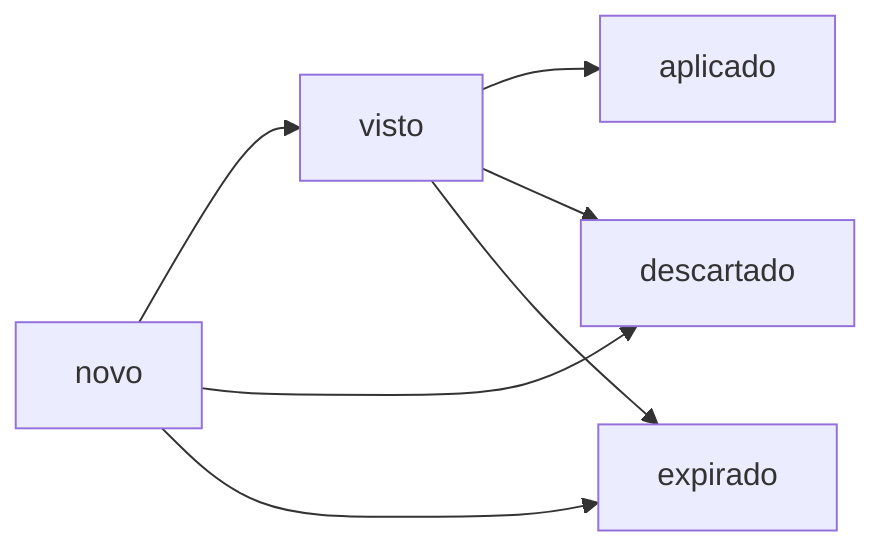
```mermaid
flowchart LR
    A[novo] --> B[visto]
    B --> C[aplicado]
    B --> D[descartado]
    A --> D
    A --> E[expirado]
    B --> E
```

_Implements: REQ-19.1, REQ-19.2, REQ-19.3, REQ-19.4, REQ-20.1, REQ-20.2, REQ-20.3, REQ-20.4, REQ-20.5, REQ-20.6, REQ-20.7, REQ-20.8, REQ-21.1, REQ-21.2, REQ-21.3, REQ-21.4, REQ-21.5, REQ-21.6_

### DES-18: Agendador e portão de recuperação

O agendador enfileira runs recorrentes em rodízio, garantindo que nenhum usuário seja atendido duas vezes antes que todos os ativos tenham sido atendidos uma vez. Com capacidade de coleta serializada e escassa, a ordem de atendimento é a diferença entre um serviço justo e um serviço que atende sempre os mesmos.

Um bloqueio de coleta suspende os próximos runs de todos, não apenas do usuário que o provocou, porque o recurso bloqueado é comum. Como o disparo do ciclo pode vir de um agendador externo que não sabe o que aconteceu antes, o adiamento não mora no agendador: é um portão na entrada do run, que consulta o último bloqueio e encerra sem tocar a rede se ainda estiver dentro do intervalo de recuperação. Run em andamento além da duração máxima é marcado interrompido e libera a vez, o que impede um processo morto de travar a fila para sempre.

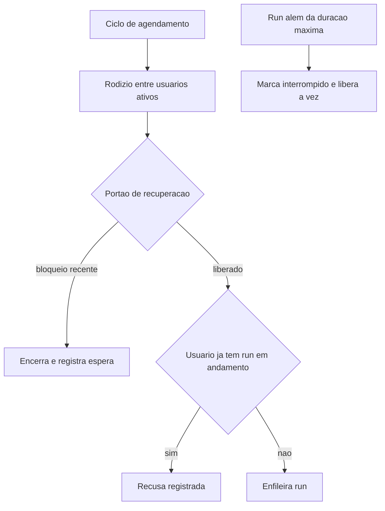
```mermaid
flowchart TD
    A[Ciclo de agendamento] --> B[Rodizio entre usuarios ativos]
    B --> C{Portao de recuperacao}
    C -->|bloqueio recente| D[Encerra e registra espera]
    C -->|liberado| E{Usuario ja tem run em andamento}
    E -->|sim| F[Recusa registrada]
    E -->|nao| G[Enfileira run]
    H[Run alem da duracao maxima] --> I[Marca interrompido e libera a vez]
```

_Implements: REQ-22.1, REQ-22.2, REQ-22.3, REQ-22.4, REQ-22.5, REQ-22.6, REQ-22.7, REQ-22.8_

### DES-19: Configuração e segredos

A configuração é lida de arquivo e validada por esquema na inicialização, antes de qualquer acesso a rede ou banco. Valor inválido ou ausente impede a inicialização nomeando a chave e o valor esperado, em vez de produzir um comportamento padrão silencioso. A configuração efetiva de cada run é gravada no seu registro, para que um relatório antigo possa ser explicado pelos valores que o produziram.

Segredos do operador vivem em variáveis de ambiente e nunca em arquivo de configuração nem em código. Um filtro de redação instalado na inicialização remove segredos, testemunhos de acesso, credenciais de provedor e cookies de sessão de qualquer registro de log, o que faz do vazamento em log um defeito localizado no filtro em vez de um descuido possível em cada chamada.

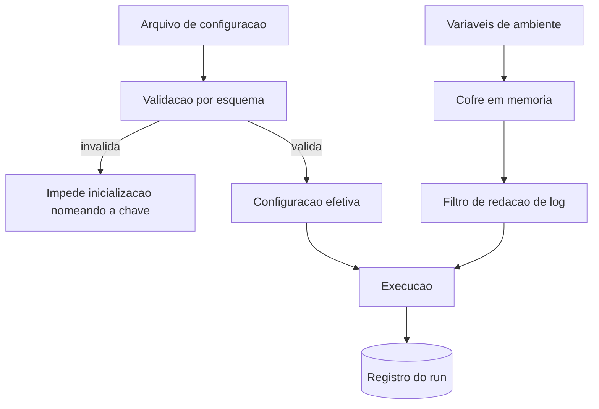
```mermaid
flowchart TD
    A[Arquivo de configuracao] --> B[Validacao por esquema]
    B -->|invalida| C[Impede inicializacao nomeando a chave]
    B -->|valida| D[Configuracao efetiva]
    E[Variaveis de ambiente] --> F[Cofre em memoria]
    F --> G[Filtro de redacao de log]
    D --> H[Execucao]
    G --> H
    H --> I[(Registro do run)]
```

_Implements: REQ-23.1, REQ-23.2, REQ-23.3, REQ-24.1, REQ-24.2, REQ-24.3, REQ-24.4_

### DES-20: Insights lidos no navegador do usuário

Os sinais que o LinkedIn calcula contra o perfil logado — "You'd be a top applicant", sobretudo — não existem na rota pública, e o desenho recusa guardar sessão de qualquer conta. A extensão resolve as duas coisas de uma vez: ela roda na página que o próprio usuário está vendo, lê os cards por padrão de texto e envia só o resultado — contagem, senioridade, sinais. O servidor recebe números, nunca o meio de refazer a leitura sem o usuário.

Duas rotas recebem esses envios: uma por vaga e uma em lote, para a página de resultados, que mostra dezenas de cards de uma vez. Cada item do lote é gravado ou recusado sozinho. A validação é estrita porque o dado vem de uma página que o sistema não controla: sinal fora da lista aceita é descartado, contagem fora da faixa de sanidade é ignorada e envio sem nada reconhecível é recusado com a causa. Sinais recebidos se unem aos da coleta em vez de substituí-los. Vaga desconhecida com título e endereço é criada para o usuário autenticado, com a origem gravada como `extensao`, porque a navegação de quem usa e as buscas do planejador quase não se sobrepõem.

A autenticação tem duas portas para as mesmas rotas. A sessão serve a quem chama do próprio app. O token do extrator serve à extensão, porque o cookie de sessão é `samesite=lax` e o navegador o retém num POST vindo do LinkedIn; afrouxá-lo abriria CSRF em todas as outras rotas. O token viaja em cabeçalho, vale só para as rotas de insight, é emitido por POST numa página que exige sessão, invalida o anterior ao ser reemitido e é guardado apenas como hash. A liberação de origem é nominal — só `https://www.linkedin.com` — e existe só nessas rotas.

No pipeline, `top_applicant` adianta a vaga na fila de enriquecimento, porque o orçamento diário acaba antes da fila e vaga sem descrição pontua pior. No relatório ele muda a recomendação para candidatura imediata, inclusive diante de muitos candidatos, e não se sobrepõe a requisito eliminatório não atendido.

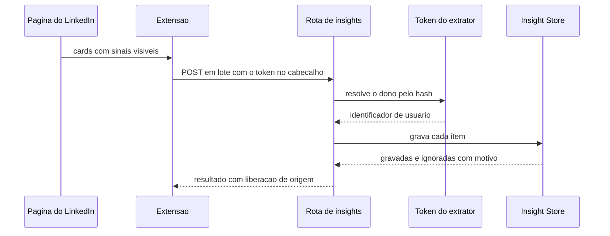
```mermaid
sequenceDiagram
    participant P as Pagina do LinkedIn
    participant X as Extensao
    participant A as Rota de insights
    participant T as Token do extrator
    participant I as Insight Store
    P->>X: cards com sinais visiveis
    X->>A: POST em lote com o token no cabecalho
    A->>T: resolve o dono pelo hash
    T-->>A: identificador de usuario
    A->>I: grava cada item
    I-->>A: gravadas e ignoradas com motivo
    A-->>X: resultado com liberacao de origem
```

_Implements: REQ-27.1, REQ-27.2, REQ-27.3, REQ-27.4, REQ-27.5, REQ-27.6, REQ-27.7, REQ-27.8, REQ-27.9, REQ-27.10, REQ-27.11, REQ-27.12, REQ-27.13, REQ-27.14, REQ-27.15, REQ-27.16, REQ-27.17, REQ-27.18_

### DES-21: Releitura do topo por modelo

O cálculo determinístico erra num ponto e erra caro: o componente de competências é uma proporção, então anúncio vago, que pede pouco, pontua acima de vaga exigente. Nenhum peso corrige isso. O estágio `julgamento` roda entre a pontuação final e a síntese e manda ao modelo o perfil-alvo e as vagas do topo do relatório, na ordem em que o usuário vai lê-las, numa tarefa própria com gabarito de sistema distinto do da síntese.

O corpo respeita o teto de texto externo do cliente de modelo, que corta pelo fim — e o fim de um pedido é onde ficariam as instruções. Por isso o formato da resposta vive no gabarito de sistema e a descrição é fatiada igualmente entre as vagas. Vaga sem descrição, ou sem espaço para ela, entra marcada, e não omitida.

A leitura da resposta tolera a pontuação que um modelo real usa — marcador de lista, colchete, travessão, `20/100` — e nunca afrouxa o identificador: nota de vaga que não foi enviada, ou fora de 0 a 100, é descartada. Nota e motivo ficam em colunas próprias ao lado do score, que continua gravado e reprodutível. Sem cliente de modelo, com cadeia esgotada, erro de provedor ou resposta sem linha legível, o run segue com a ordem determinística e registra o motivo. Onde há nota do modelo, o relatório ordena por ela e mostra de onde veio cada número.

```mermaid
flowchart TD
    A[Pontuacao final] --> B[Topo do relatorio]
    B --> C{Cliente de modelo disponivel}
    C -->|nao| D[Ordem deterministica e motivo registrado]
    C -->|sim| E[Pedido dentro do teto com fatia igual por vaga]
    E --> F{Linhas com identificador enviado e nota de 0 a 100}
    F -->|nenhuma| D
    F -->|alguma| G[(Nota e motivo ao lado do score)]
    G --> H[Relatorio ordena pela nota do modelo]
    D --> I[Sintese]
    H --> I
```

_Implements: REQ-28.1, REQ-28.2, REQ-28.3, REQ-28.4, REQ-28.5, REQ-28.6, REQ-28.7, REQ-28.8, REQ-28.9, REQ-28.10_

## Data Flow

```mermaid
flowchart LR
    A[Curriculo importado] -->|provedor do usuario| B[Extracao nao confirmada]
    B -->|conferencia humana| C[Extracao confirmada]
    D[Conexao LinkedIn] --> E[Perfil consolidado]
    C --> E
    E --> F[Buscas]
    F -->|camada guest| G[Cards]
    G -->|pre-filtro| H[Sobreviventes]
    H -->|score provisorio| I[Fila ordenada]
    I -->|cota de coleta| J[Descricoes e sinais]
    J -->|score final| K[Scores e lacunas]
    K -->|topo| N[Releitura do modelo]
    N --> L[Sintese]
    N --> M[Relatorio]
    L --> M
    O[Extensao no navegador] -->|sinais e contagens| J
    O -->|vaga desconhecida| G
```

## Data Models

| Tabela | Chave | Campos relevantes | Elemento |
|--------|-------|-------------------|----------|
| `users` | `user_id` | subject_google, email, criado_em, ultima_sessao_em | DES-2, DES-17 |
| `sessions` | `session_id` | user_id, testemunho_hash, expira_em | DES-2 |
| `linkedin_connections` | `user_id` | campos_identidade, escopos_concedidos, campos_indisponiveis, estado, token_cifrado | DES-3 |
| `provider_credentials` | `credential_id` | user_id, provedor, chave_cifrada, chave_de_dado_cifrada, sufixo, ordem, criado_em | DES-4 |
| `resumes` | `resume_id` | user_id, texto, origem, hash_conteudo, importado_em | DES-6 |
| `resume_extractions` | `extraction_id` | resume_id, user_id, campos, trechos_origem, lacunas, provedor, modelo, confirmado_em | DES-7 |
| `profile_versions` | `version_id` | user_id, campos, origem_por_campo, nivel_inferido, problemas_higiene, criado_em | DES-8 |
| `jobs` | `job_id`, `user_id` | titulo, empresa, url, local, modelo, publicada_em, flags, blocker, estado, primeira_vez_em, ultima_vez_em, ausencias_elegiveis, busca | DES-10, DES-17, DES-20 |
| `job_descriptions` | `job_id` | texto, emails_contato, candidatos, distribuicao_senioridade, coletada_em | DES-12, DES-17 |
| `scores` | `job_id`, `run_id`, `passada` | user_id, score, componentes, lacunas, diferenciais, descricao_disponivel, sinais_sessao_disponiveis, nota_do_modelo, motivo_do_modelo | DES-14, DES-21 |
| `runs` | `run_id` | user_id, estado, janela, iniciado_em, heartbeat_em, encerrado_em, buscas, config_efetiva, contagens, cota_consumida, cota_esgotada, bloqueios, provedor_sintese, tokens, falha_sintese | DES-1, DES-17 |
| `discards` | `run_id`, `job_id` | titulo, empresa, motivo | DES-11 |
| `daily_quota` | `user_id`, `dia` | consumida, limite | DES-13 |
| `collection_blocks` | `block_id` | ocorrido_em, tentativas, liberado_em | DES-12, DES-18 |
| `data_subject_ops` | `op_id` | user_id, tipo, instante | DES-17 |
| `extractor_tokens` | `token_hash` | user_id, criado_em, ultimo_uso_em | DES-20 |
| `schema_meta` | `chave` | versao_esquema, aplicada_em | DES-17 |

## Error Handling

| Falha | Detecção | Resposta | Requisito |
|-------|----------|----------|-----------|
| Autorização Google cancelada ou com erro | Retorno do fluxo | Recusa a sessão nomeando a causa | REQ-1.3 |
| Sessão expirada | Comparação com o relógio do servidor | Apaga a sessão e exige nova autorização | REQ-1.4 |
| Credencial LinkedIn submetida por formulário | Fronteira do conector | Recusa antes de qualquer armazenamento | REQ-2.2 |
| Testemunho LinkedIn expirado | Resposta do provedor | Marca conexão expirada e pede reconexão | REQ-2.6 |
| Formato, tamanho ou frequência de currículo fora do limite | Verificação antes da extração | Recusa nomeando o limite violado | REQ-3.4, REQ-3.5, REQ-3.9 |
| Documento sem camada de texto | Comprimento mínimo do texto extraído | Recusa com a hipótese explícita | REQ-3.6 |
| Usuário sem credencial de provedor | Consulta ao cofre | Oferece preenchimento manual sem emitir requisição | REQ-4.12 |
| Extração estruturada falha | Cliente de modelo | Registra a falha e oferece preenchimento manual | REQ-4.8 |
| Nenhuma origem fornece histórico | Consolidador | Recusa o início do run com instrução ao usuário | REQ-5.5 |
| Busca com erro de rede | Camada guest | Registra a busca como falha e continua | REQ-8.6 |
| Busca com zero resultados | Camada guest | Registra como improdutiva e continua | REQ-8.5 |
| Descrição indisponível | Enriquecedor | Marca vaga sem descrição e continua | REQ-10.2 |
| Três falhas consecutivas de enriquecimento | Governador de taxa | Grava bloqueio e recusa novas chamadas | REQ-11.4, REQ-11.5 |
| Cota do usuário esgotada | Alocador de cota | Recusa o enriquecimento e registra no run | REQ-12.3 |
| Provedor recusa por limite de uso | Cliente de modelo | Tenta o próximo provedor da ordem do usuário | REQ-26.8 |
| Cadeia de provedores esgotada | Cliente de modelo | Registra falha e conclui o run em modo determinístico | REQ-26.9 |
| Violação de aterramento na resposta | Verificador | Descarta a resposta e registra a violação | REQ-16.4 |
| Provedor configurado indisponível | Verificação de disponibilidade | Exclui da lista oferecida ao usuário | REQ-25.5 |
| Credencial inválida no cadastro | Validação contra o provedor | Recusa o armazenamento e mostra a causa | REQ-26.2 |
| Falha de gravação no banco | Repositório | Encerra o run nomeando a operação e a causa | REQ-21.6 |
| Estágio de run levanta exceção | Executor | Marca o run interrompido com a causa e segue para o próximo run | REQ-22.8 |
| Run retomado sem estado em memória | Estágio de coleta | Lê as buscas gravadas no registro do run | REQ-7.7 |
| Esquema mais novo que o código | Comparação de versão na abertura | Impede a inicialização | REQ-21.6 |
| Requisição a recurso de outro usuário | Filtro do repositório | Recusa e registra a tentativa | REQ-19.3 |
| Run concorrente do mesmo usuário | Estado do run no banco | Recusa e registra | REQ-22.2 |
| Run travado além da duração máxima | Heartbeat vencido | Marca interrompido e libera a vez | REQ-22.4 |
| Configuração inválida ou ausente | Validação por esquema | Impede a inicialização nomeando a chave | REQ-24.3 |
| Envio de insight sem sessão nem token válido | Guarda da rota de insights | Recusa dizendo onde emitir o token | REQ-27.10 |
| Envio de insight sem nada reconhecível | Insight Store | Recusa nomeando a causa | REQ-27.4 |
| Vaga desconhecida sem título ou endereço | Insight Store | Recusa o item e grava os demais do lote | REQ-27.6, REQ-27.7 |
| Releitura sem cliente, com cadeia esgotada ou resposta ilegível | Juiz | Mantém a ordem determinística e registra o motivo | REQ-28.7, REQ-28.8 |

## Code Anatomy

| File Path | Status | Evidence | Purpose | Implements |
|-----------|--------|----------|---------|------------|
| `src/crivo/web/app.py` | New | Proposto por DES-1 | Aplicação web e rotas | DES-1 |
| `src/crivo/web/auth.py` | New | Proposto por DES-2 | Fluxo Google e ciclo de sessão | DES-2 |
| `src/crivo/web/linkedin.py` | New | Proposto por DES-3 | Fluxo de autorização do LinkedIn | DES-3 |
| `src/crivo/web/credentials.py` | New | Proposto por DES-4 | Cadastro, ordem e remoção de credenciais | DES-4 |
| `src/crivo/web/resume.py` | New | Proposto por DES-6 | Importação e tela de conferência | DES-6, DES-7 |
| `src/crivo/worker/runner.py` | New | Proposto por DES-1 | Consumidor da fila e execução do pipeline | DES-1 |
| `src/crivo/worker/enricher_process.py` | New | Proposto por DES-12 | Processo único de enriquecimento | DES-12 |
| `src/crivo/worker/queue.py` | New | Proposto por DES-1 | Fila em banco com reserva de linha | DES-1 |
| `src/crivo/providers/registry.py` | New | Proposto por DES-4 | Carga e validação do registro de provedores | DES-4 |
| `src/crivo/providers/vault.py` | New | Proposto por DES-4 | Cifragem envelopada das credenciais | DES-4 |
| `src/crivo/providers/client.py` | New | Proposto por DES-5 | Camada fina sobre o roteador: ordem do usuário, contenção e queda para modo determinístico | DES-5 |
| `src/crivo/resume/importer.py` | New | Proposto por DES-6 | Normalização de Drive, Word e PDF para texto | DES-6 |
| `src/crivo/resume/parser.py` | New | Proposto por DES-7 | Extração estruturada e portão de conferência | DES-7 |
| `src/crivo/profile/merger.py` | New | Proposto por DES-8 | Precedência entre origens e versionamento | DES-8 |
| `src/crivo/profile/seniority.py` | New | Proposto por DES-8 | Inferência determinística de nível | DES-8 |
| `src/crivo/profile/hygiene.py` | New | Proposto por DES-8 | Diagnóstico de problemas do perfil | DES-8 |
| `src/crivo/pipeline/planner.py` | New | Proposto por DES-9 | Geração determinística de buscas | DES-9 |
| `src/crivo/pipeline/collector.py` | New | Proposto por DES-10 | Orquestração das buscas, normalização e dedupe | DES-10 |
| `src/crivo/pipeline/sources/guest.py` | New | Proposto por DES-10 | Adaptador do coletor multi-portal para o card normalizado | DES-10 |
| `src/crivo/pipeline/prefilter.py` | New | Proposto por DES-11 | Rejeição por título e avaliação geográfica | DES-11 |
| `src/crivo/pipeline/governor.py` | New | Proposto por DES-12 | Serialização, atraso, recuo e bloqueio | DES-12 |
| `src/crivo/pipeline/quota.py` | New | Proposto por DES-13 | Cálculo e débito da cota diária | DES-13 |
| `src/crivo/scoring/ontology.py` | New | Proposto por DES-14 | Canonicalização de competências | DES-14 |
| `src/crivo/scoring/scorer.py` | New | Proposto por DES-14 | Componentes, ajustes e limite final | DES-14 |
| `src/crivo/scoring/gaps.py` | New | Proposto por DES-14 | Lacunas, diferenciais e agregação | DES-14 |
| `src/crivo/synthesis/prompt.py` | New | Proposto por DES-15 | Gabarito fixo e empacotamento não confiável | DES-15 |
| `src/crivo/synthesis/grounding.py` | New | Proposto por DES-15 | Verificação de aterramento | DES-15 |
| `src/crivo/report/renderer.py` | New | Proposto por DES-16 | Montagem do contexto do relatório | DES-16 |
| `src/crivo/report/templates/` | New | Proposto por DES-16 | Gabaritos com escape automático | DES-16 |
| `src/crivo/store/schema.sql` | New | Proposto por DES-17 | Definição de tabelas e índices | DES-17 |
| `src/crivo/store/migrations.py` | New | Proposto por DES-17 | Versionamento e migração ordenada | DES-17 |
| `src/crivo/store/repository.py` | New | Proposto por DES-17 | Acesso com filtro de usuário injetado | DES-17 |
| `src/crivo/store/lifecycle.py` | New | Proposto por DES-17 | Transições de estado e expiração | DES-17 |
| `src/crivo/store/privacy.py` | New | Proposto por DES-17 | Exclusão em cascata, exportação e retenção | DES-17 |
| `src/crivo/scheduler.py` | New | Proposto por DES-18 | Rodízio e portão de recuperação | DES-18 |
| `src/crivo/config.py` | New | Proposto por DES-19 | Leitura e validação por esquema | DES-19 |
| `src/crivo/logging_filters.py` | New | Proposto por DES-19 | Redação de segredos em log | DES-19 |
| `src/crivo/__main__.py` | New | Acrescentado na implementação | Ponto de entrada único: sobe web, runs, enricher, schedule ou os três de uso normal | DES-1, DES-19 |
| `src/crivo/secrets_vault.py` | New | Acrescentado na implementação | Cofre em memória dos segredos do operador, lidos do ambiente e do `.env` | DES-19 |
| `src/crivo/pipeline/stages.py` | New | Acrescentado na implementação | Estágios do run na ordem em que acontecem, da coleta à síntese | DES-1, DES-21 |
| `src/crivo/pipeline/enricher.py` | New | Acrescentado na implementação | Enriquecimento das vagas que sobreviveram ao pré-filtro | DES-12 |
| `src/crivo/worker/enrichment_queue.py` | New | Acrescentado na implementação | Fila do enriquecimento, ponto de suspensão entre os dois trechos do run | DES-1, DES-12 |
| `src/crivo/profile/periodo.py` | New | Acrescentado na implementação | Leitura de período de experiência num lugar só | DES-8 |
| `src/crivo/pipeline/presenca.py` | New | Acrescentado na implementação | Leitura, na descrição, de quantos dias de escritório a vaga exige | DES-11, DES-14 |
| `src/crivo/store/scores.py` | New | Acrescentado na implementação | Persistência das pontuações nas duas passadas, com histórico | DES-14 |
| `src/crivo/store/locks.py` | New | Acrescentado na implementação | Travas de instância única gravadas no banco | DES-1, DES-12 |
| `src/crivo/store/insights.py` | New | Acrescentado na implementação | Validação e gravação dos insights enviados pela extensão | DES-20 |
| `src/crivo/store/extractor_tokens.py` | New | Acrescentado na implementação | Emissão, resolução e revogação do token do extrator | DES-20 |
| `src/crivo/scoring/judge.py` | New | Acrescentado na implementação | Releitura do topo por modelo | DES-21 |
| `src/crivo/synthesis/synthesizer.py` | New | Acrescentado na implementação | Estágio terminal de síntese, uma requisição lógica por run | DES-15 |
| `src/crivo/web/tempo.py` | New | Acrescentado na implementação | Apresentação de carimbo de tempo num lugar só | DES-16 |
| `src/crivo/web/templates/`, `src/crivo/web/static/crivo.css` | New | Acrescentado na implementação | Telas do app e folha de estilo única | DES-1 |
| `config/cidades.toml` | New | Acrescentado na implementação | Coordenadas das cidades do cálculo de distância do pré-filtro | DES-11 |
| `tools/extensao/` | New | Acrescentado na implementação | Extensão de navegador que lê os cards e envia os insights | DES-20 |
| `config/default.toml` | New | Proposto por DES-19 | Valores padrão de todo parâmetro | DES-19 |
| `config/providers.toml` | New | Proposto por DES-4 | Registro de provedores habilitados | DES-4 |
| `config/ontology.toml` | New | Proposto por DES-14 | Mapa de sinônimos de tecnologia | DES-14 |
| `config/filters.toml` | New | Proposto por DES-11 | Padrões de rejeição e âncoras | DES-9, DES-11 |
| `.env.example` | New | Proposto por DES-19 | Nomes das variáveis de segredo, sem valores | DES-19 |
| `tests/` | New | Proposto por DES-1 | Suíte por componente e de integração | DES-1 |

## Repository Context Evidence

| Source | Evidence | Applied Constraint |
|--------|----------|--------------------|
| `AGENTS.md`, `ARCHITECTURE.md`, `STYLEGUIDE.md`, `TESTING.md`, `SECURITY.md` | Verificados por Glob: ausentes | Sem convenções documentadas; preferida a biblioteca padrão a novas abstrações |
| Código-fonte do repositório | Verificado por Glob: nenhum arquivo de código | Projeto greenfield; nenhum padrão existente a reusar |
| `contextual-stewardship:design` | Consultado antes do design: zero regras | Nenhuma regra arquitetural ativa a aplicar |
| `.specs/changes/linkedin-job-agent/requirements.md` | Lido antes do design | Fonte de verdade para todo elemento deste documento |
| `specagentevagaslinkedin.md` | Lido antes do design | Comportamento observado da origem tratado como restrição de projeto |
| Design anterior do mesmo slug | Substituído nesta fase | Preservadas as decisões que sobreviveram à mudança de escopo: governador de taxa, pontuação em duas passadas, regra de expiração por janela, versionamento de esquema, portão de recuperação |

## Impact Analysis

### Testing Requirements

| Alvo | Tipo | Critério de verificação |
|------|------|-------------------------|
| Planejador de buscas | Unitário | Mesma entrada produz lista idêntica; nenhuma busca de termo único |
| Scorer | Unitário | Determinismo; resultado entre 0 e 100 com ajustes extremos |
| Ontologia | Unitário | Variantes declaradas colapsam no mesmo termo canônico |
| Pré-filtro | Unitário | Remoto ignora geografia; presencial fora do raio mantém blocker |
| Governador de taxa | Unitário com relógio falso | Serialização; recuo cresce; três falhas gravam bloqueio |
| Alocador de cota | Unitário | Acerto no registro compartilhado não debita; virada do dia não transporta saldo |
| Regra de expiração | Unitário | Vaga fora da janela do run não acumula ausência elegível |
| Portão de conferência | Unitário | Run ignora extração não confirmada |
| Cadeia de fallback | Unitário com provedores falsos | Recusa por limite avança na ordem do usuário; cadeia esgotada cai em modo determinístico |
| Cofre de credenciais | Unitário | Valor nunca retorna em claro para a interface; remoção apaga |
| Isolamento | Integração | Consulta com sessão de A nunca devolve linha de B |
| Exclusão de conta | Integração | Apaga todo dado do titular e preserva o registro compartilhado de descrições |
| Renderizador | Unitário | Texto de origem com marcação aparece escapado; estados degradados marcados |
| Verificador de aterramento | Unitário | Resposta com identificador estranho é descartada |
| Adaptadores de origem | Integração com respostas gravadas | Normalização estável sem contato com a rede |
| Pipeline completo | Integração | Run com origens e provedores falsos produz banco e relatório coerentes |

### Dependencies

| Dependência | Papel | Alternativa considerada |
|-------------|-------|-------------------------|
| `fastapi` e `uvicorn` | Camada web e rotas | Framework completo com ORM; descartado por trazer camadas que este desenho não usa |
| `jinja2` | Gabaritos com escape automático | Interpolação manual; descartada porque tornaria o escape disciplina em vez de garantia |
| `sqlite3` | Acesso ao banco embarcado | Servidor de banco; descartado porque o teto de vazão do sistema não o justifica e ele acrescentaria um serviço para o operador manter |
| `litellm` | Roteamento entre provedores de modelo, com cadeia ordenada, recuo e período de espera | Cliente próprio por provedor; descartado por reimplementar pior um problema já resolvido e por exigir manutenção a cada mudança de formato de erro |
| `python-jobspy` | Coleta multi-portal da camada guest, incluindo descrição e endereços de contato | Cliente artesanal contra a marcação da origem; descartado porque era o item de maior probabilidade da matriz de risco |
| `pandas` | Formato de saída exigido pelo coletor multi-portal | Nenhuma; entra como dependência transitiva. É pesada para o porte deste serviço e fica confinada ao adaptador, que converte a saída tabular para o card normalizado e não deixa o tipo vazar para o resto do sistema |
| `httpx` | Camada guest, provedores e fluxos de autorização | `urllib`; descartada por ausência de reuso de conexão e tempo limite granular |
| `python-docx` e `pypdf` | Extração de texto de Word e PDF | Conversão por processo externo; descartada por dependência de binário do sistema |
| `cryptography` | Cifragem envelopada das credenciais | Cifragem artesanal; descartada por princípio |
| `pytest` | Execução da suíte | `unittest`; descartada por ergonomia de fixtures |
| `tomllib`, `re`, `dataclasses`, `secrets` | Configuração, padrões, estruturas e testemunhos | Biblioteca padrão; sem dependência adicional |

As três adoções desta versão substituem código que estava planejado: o roteamento entre provedores, o cliente de coleta e o servidor de banco. Nenhuma delas alcança o que é específico deste produto — a cota por usuário sobre capacidade compartilhada, o portão de conferência da extração, a pontuação determinística em duas passadas, o verificador de aterramento e os direitos do titular continuam sendo código nosso.

### Breaking Changes

Não há contrato publicado a quebrar: o projeto ainda não tem código. O documento de design anterior deste mesmo slug foi substituído por incompatibilidade de escopo, e as suas referências de rastreabilidade não são reaproveitáveis.

### Risk Assessment

| Risco | Probabilidade | Impacto | Mitigação de projeto |
|-------|---------------|---------|----------------------|
| Bloqueio da instalação pela origem | Baixa | Alto | Coleta inteiramente por rota pública, sem conta a perder; processo de enriquecimento único, governador com recuo e cota diária por usuário |
| Extração ruim por modelo fraco corromper o perfil | **Alta** | Alto | Conferência humana como portão de estado; proveniência de provedor e modelo gravada em cada extração |
| Oferta gratuita de provedor encerrada ou reduzida | Alta | Médio | Registro em configuração, cadeia de fallback por usuário, modo determinístico como piso funcional |
| Vazamento de credenciais de usuários | Baixa | **Alto** | Cifragem envelopada, valor nunca reexibido, filtro de redação em log |
| Exposição de dado pessoal entre usuários | Baixa | Alto | Filtro de usuário injetado na camada de acesso, recusa registrada em referência cruzada |
| Mudança de marcação na origem quebrar a extração | Média | Médio | Descoberta delegada a biblioteca mantida; a extração do anúncio depende de marcação e falha de forma explícita, com o identificador da vaga na mensagem, em vez de devolver texto vazio |
| Biblioteca de terceiros abandonada ou com mudança incompatível | Média | Médio | Adaptadores isolados atrás do protocolo de fonte; a saída da biblioteca é convertida no próprio adaptador e nada além dele conhece o formato |
| Um usuário ativo consumir a capacidade de todos | Média | Médio | Cota diária sem transporte de saldo e rodízio no agendamento |
| Uso contrariar os Termos de Serviço da origem | Certa | Variável | Registrado como premissa aceita; volume contido por cota, serialização e execução incremental |

### Rollback Plan

Cada migração de esquema tem passo inverso declarado, e a versão do esquema é comparada na abertura: um binário mais antigo que o banco recusa iniciar em vez de operar sobre estrutura desconhecida. Como o banco é um arquivo único, a cópia de segurança anterior a uma migração é uma cópia de arquivo, e o retorno é a restauração dessa cópia. O registro de provedores e os arquivos de filtro e ontologia são configuração, então reverter uma alteração de comportamento de triagem ou de provedor é troca de arquivo e reinício, sem migração.

## Traceability Matrix

| Design Element | Requirements |
|----------------|--------------|
| DES-1 | REQ-11.1, REQ-17.1, REQ-22.2, REQ-22.4 |
| DES-2 | REQ-1.1, REQ-1.2, REQ-1.3, REQ-1.4, REQ-1.5, REQ-1.6 |
| DES-3 | REQ-2.1, REQ-2.2, REQ-2.3, REQ-2.4, REQ-2.5, REQ-2.6 |
| DES-4 | REQ-23.4, REQ-25.1, REQ-25.2, REQ-25.3, REQ-25.4, REQ-25.5, REQ-25.6, REQ-25.7, REQ-26.1, REQ-26.2, REQ-26.3, REQ-26.4, REQ-26.5, REQ-26.6, REQ-26.11, REQ-26.12 |
| DES-5 | REQ-16.1, REQ-16.2, REQ-16.3, REQ-26.7, REQ-26.8, REQ-26.9, REQ-26.10 |
| DES-6 | REQ-3.1, REQ-3.2, REQ-3.3, REQ-3.4, REQ-3.5, REQ-3.6, REQ-3.7, REQ-3.8, REQ-3.9 |
| DES-7 | REQ-4.1, REQ-4.2, REQ-4.3, REQ-4.4, REQ-4.5, REQ-4.6, REQ-4.7, REQ-4.8, REQ-4.9, REQ-4.10, REQ-4.11, REQ-4.12, REQ-16.5 |
| DES-8 | REQ-5.1, REQ-5.2, REQ-5.3, REQ-5.4, REQ-5.5, REQ-5.6, REQ-5.7, REQ-5.8, REQ-6.1, REQ-6.2, REQ-6.3 |
| DES-9 | REQ-7.1, REQ-7.2, REQ-7.3, REQ-7.4, REQ-7.5, REQ-7.6, REQ-7.7 |
| DES-10 | REQ-8.1, REQ-8.2, REQ-8.3, REQ-8.5, REQ-8.6, REQ-8.7 |
| DES-11 | REQ-9.1, REQ-9.2, REQ-9.3, REQ-9.4, REQ-9.5, REQ-9.6 |
| DES-12 | REQ-10.1, REQ-10.2, REQ-10.3, REQ-10.4, REQ-10.5, REQ-10.6, REQ-10.7, REQ-11.1, REQ-11.2, REQ-11.3, REQ-11.4, REQ-11.5, REQ-11.6 |
| DES-13 | REQ-12.1, REQ-12.2, REQ-12.3, REQ-12.4, REQ-12.5 |
| DES-14 | REQ-13.1, REQ-13.2, REQ-13.3, REQ-13.4, REQ-13.5, REQ-13.6, REQ-13.7, REQ-13.8, REQ-13.9, REQ-13.10, REQ-13.11, REQ-14.1, REQ-14.2, REQ-14.3, REQ-14.4, REQ-14.5, REQ-14.6 |
| DES-15 | REQ-15.1, REQ-15.2, REQ-15.3, REQ-15.4, REQ-15.5, REQ-15.6, REQ-15.7, REQ-15.8, REQ-15.9, REQ-15.10, REQ-15.11, REQ-15.12, REQ-16.4 |
| DES-16 | REQ-17.1, REQ-17.2, REQ-17.3, REQ-18.1, REQ-18.2, REQ-18.3, REQ-18.4, REQ-18.5, REQ-18.6, REQ-18.7, REQ-18.8, REQ-18.9, REQ-18.10, REQ-18.11, REQ-18.12, REQ-18.13, REQ-18.14 |
| DES-17 | REQ-19.1, REQ-19.2, REQ-19.3, REQ-19.4, REQ-20.1, REQ-20.2, REQ-20.3, REQ-20.4, REQ-20.5, REQ-20.6, REQ-20.7, REQ-20.8, REQ-21.1, REQ-21.2, REQ-21.3, REQ-21.4, REQ-21.5, REQ-21.6 |
| DES-18 | REQ-22.1, REQ-22.2, REQ-22.3, REQ-22.4, REQ-22.5, REQ-22.6, REQ-22.7, REQ-22.8 |
| DES-19 | REQ-23.1, REQ-23.2, REQ-23.3, REQ-24.1, REQ-24.2, REQ-24.3, REQ-24.4 |
| DES-20 | REQ-27.1, REQ-27.2, REQ-27.3, REQ-27.4, REQ-27.5, REQ-27.6, REQ-27.7, REQ-27.8, REQ-27.9, REQ-27.10, REQ-27.11, REQ-27.12, REQ-27.13, REQ-27.14, REQ-27.15, REQ-27.16, REQ-27.17, REQ-27.18 |
| DES-21 | REQ-28.1, REQ-28.2, REQ-28.3, REQ-28.4, REQ-28.5, REQ-28.6, REQ-28.7, REQ-28.8, REQ-28.9, REQ-28.10 |
